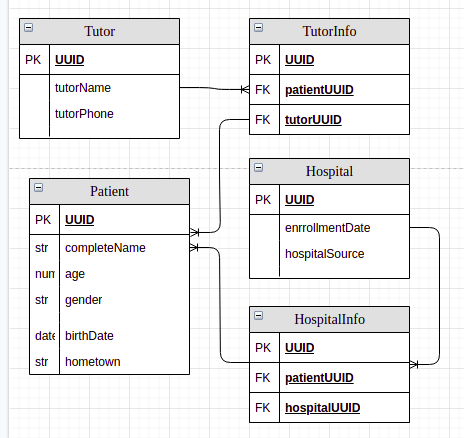

# Hospital CRUD
## Instalacion de paquetes

``` bash 
npm install 
```

## Crear el archivo .env para establecer el puerto, basado en .env.example


## Crear el archivo ormconfig.json basado en el archivo ormconfig-example.json

``` json
{
    "type": "mysql",
    "host": "localhost",
    "port": 3306,
    "username": "root",
    "password": "PASSWORD",
    "database": "crudHospital",
    "entities": ["./src/schema/*.js"],
    "synchronize": true
  }
```

## Crear un contenedor para la base de datos, recomendado Docker

``` bash 
docker run -p 3306:3306 -d --name some-mysql -e MYSQL_ROOT_PASSWORD=PASSWORD mysql:8.0
```

## Crear la base de datos en mysql nativo o en nuestr contenedor de docker
### Para entrar a la terminar de mysql en docker
```bash
docker exec -it some-mysql mysql -u root -p
```
## Ejecutar el proyecto 

```bash
npm start
```

## Schema

